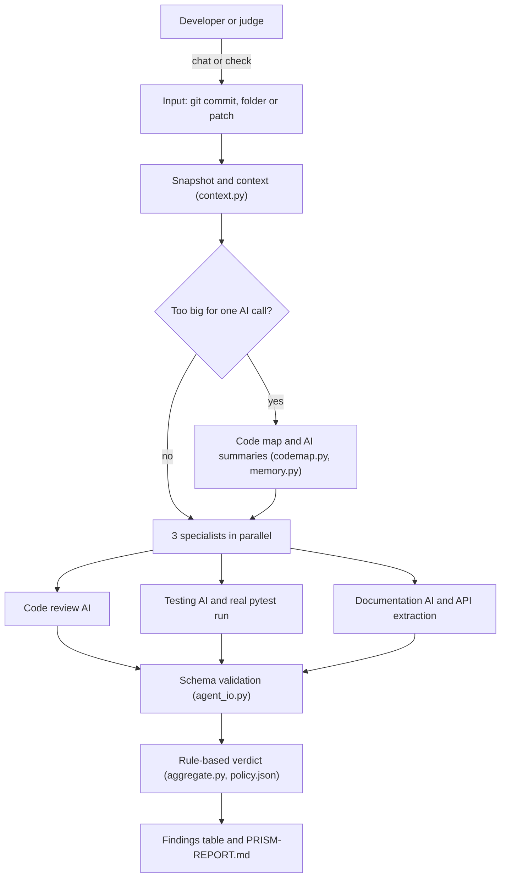

# PRism-AI 🔮

**A pre-review code checker you can talk to.** Point PRism-AI at any project and it runs three
AI specialists — **code review**, **testing** and **documentation** — in parallel, runs the
project's real tests, and tells you what is wrong, where, and what to fix first.

```
RESULT: ATTENTION REQUIRED   ⚠️  (1 critical · 6 high · 8 medium · 6 suggestions)

  #  Severity  Area           Where                            Problem
  1  CRITICAL  Security       shopmart/reports/sales.py:7      sales_for_customer builds SQL by f-string …
  2  HIGH      Security       shopmart/users/auth.py:5         Hardcoded admin credentials and unsalted MD5 …
  3  HIGH      Security       shopmart/users/profile.py:9      read_avatar joins user-supplied filename …

What to do first
  1. shopmart/reports/sales.py:7 — Use a parameterised query: conn.execute("… = ?", (customer_name,))
```

**Why it stands out**

- 🧪 **Real evidence** — the project's tests actually run; every finding has a file, a line and a fix.
- ⚖️ **A verdict you can trust** — AI finds problems, but fixed rules decide the result. It never says "approved".
- 💬 **Talk to it** — type `prismai` in any project folder and ask *"analyse this project and give me a report"*.
- 📂 **Any code, no setup** — any folder (no git needed), a git commit, before/after copies, or a patch file.
- 📈 **Scales and remembers** — large projects get a two-pass review; unchanged code is re-checked in ~1 s with 0 AI calls.

---

## Contents

1. [Overview](#overview)
2. [Quick start for judges (5 minutes)](#quick-start-for-judges-5-minutes)
3. [Use it on your own project: `prismai`](#use-it-on-your-own-project-prismai)
4. [Sample run](#sample-run)
5. [Key features](#key-features)
6. [Architecture](#architecture)
7. [More ways to check code](#more-ways-to-check-code)
8. [Results and exit codes](#results-and-exit-codes)
9. [Large projects and memory](#large-projects-and-memory)
10. [Configuration](#configuration)
11. [Testing](#testing)
12. [Project structure](#project-structure)
13. [Security and privacy](#security-and-privacy)
14. [Troubleshooting](#troubleshooting)
15. [Known limitations](#known-limitations)
16. [Built with IBM Bob](#built-with-ibm-bob)
17. [Further documentation](#further-documentation)

---

## Overview

**The problem.** Code often reaches reviewers with bugs, missing tests and documentation that no
longer matches the code. Reviewers spend their time on problems a machine could have caught —
and AI review tools that simply "approve" code are hard to trust.

**The solution.** PRism-AI checks code *before* human review:

1. Three AI specialists read the code, the tests and the docs **in parallel**.
2. The project's **real test suite runs**; pass/fail counts come from the test runner, not the AI.
3. Every AI answer is **checked against JSON schemas** — a missing or invalid answer can never
   count as a pass.
4. **Fixed rules decide the verdict** (`config/policy.json`), so the same findings always give
   the same result.
5. You get a **findings table, the top things to fix, and a full report** (`PRISM-REPORT.md`).

**Who it is for.** Developers who want a check before asking for review, reviewers who want
evidence instead of opinions, and teams who want AI help without giving AI the final say.

---

## Quick start for judges (5 minutes)

You need **Python 3.11+** and an API key from **any** AI provider (we use **DeepSeek**; OpenAI,
Gemini, Claude and others also work). No database, server, Docker or cloud account is needed.

```powershell
# 1. Get the code
git clone https://github.com/Hackathon-Repo-Org/PRism-AI-PROD-.git
cd PRism-AI-PROD-
pip install -r requirements.txt

# 2. Prove the backend works — no AI key needed
python prism.py test                      # ends with: ALL PASSED

# 3. Connect the AI and check the setup
$env:DEEPSEEK_API_KEY = "sk-..."          # macOS/Linux: export DEEPSEEK_API_KEY=sk-...
python prism.py doctor                    # every line OK? you are ready

# 4. Make a messy demo project (117 files, 10 planted bugs) and talk to PRism-AI about it
python tools/make_demo_project.py
python prism.py chat demo-large-project
```

In the chat, type: **`analyse this project and give me a report`**

Then compare what it found with the answer key in `demo-large-project-ANSWERS.md` (kept outside
the scanned folder, so the AI cannot read it).

> **If anything goes wrong, run `python prism.py doctor`** — it checks Python, packages, the AI
> key and connection, and prints how to fix each problem.

---

## Use it on your own project: `prismai`

Install the `prismai` command **once**, from the PRism-AI folder (note the dot at the end):

```powershell
pip install -e .
```

Then open a **new** terminal, go to **any project folder** and type `prismai` — like `git`, it
works on the folder you are in:

```
PS C:\Users\you\projects\my-shop-app> $env:DEEPSEEK_API_KEY = "sk-..."
PS C:\Users\you\projects\my-shop-app> prismai

PRism-AI - Hi! I'm your pre-review code checker.
  Project  my-shop-app  ·  117 files  ·  726 KB of code
  Memory   117 file summaries remembered  ·  last check: just now
  AI       DeepSeek · deepseek-chat
  Try: "analyse this project and give me a report" | "which parts of the code are the riskiest?"

 you › analyse this project and give me a report
   ... mapping the project files
   ... running full review and tests
 (findings table, top recommendations, then a plain-English summary — see Sample run)

 you › explain the bug in shopmart/orders/shipping.py and show me the fix
 you › /exit
```

**Commands you can type in the terminal**

| Type | To |
|---|---|
| `prismai` | Chat about the folder you are in |
| `prismai C:\other-project` | Chat about another folder |
| `prismai check --scan .` | One full check of this folder, no chat; writes `PRISM-REPORT.md` here |
| `prismai watch .` | Re-check automatically every time you save |
| `prismai doctor` | Check the setup |

**Inside the chat**, ask anything in plain English — *"which parts are riskiest?"*,
*"what does shopmart/orders do?"*, *"how do I fix number 1?"* — or use a command:

| Command | Does |
|---|---|
| `/check` | Full 3-specialist check; writes `PRISM-REPORT.md` (the official verdict) |
| `/findings` | Findings table + top recommendations from the last check |
| `/report` | Where `PRISM-REPORT.md` is, and its first lines |
| `/doctor` | Check the setup |
| `/clear` · `/help` · `/exit` | Forget the conversation · help · leave |

**How the chat works.** The AI can only use five **read-only** tools on that folder: the project
map, reading a file (400 lines at a time), searching, running the full check, and showing the
findings. It never edits your code, cannot read outside the folder, and never sees `.env` files,
keys or binaries. Chat answers are advice; the verdict always comes from the check. If no AI key
is set, `prismai` offers to set one up.

**`prismai` not found?** Open a new terminal after installing, or use the launcher that needs no
install: `C:\path\to\PRism-AI-PROD-\prismai.cmd` (macOS/Linux: `./prismai`).
`python prism.py chat <folder>` always works too.

---

## Sample run

Real runs on the demo project (117 files, ~700 KB) with DeepSeek. AI wording varies between runs.

### 1. A full check of the folder — 26 seconds

`python prism.py check --scan demo-large-project`

```
[1/4] Preparing code...
Large project: 117 files (~267,039 tokens, limit 60,000 per AI call) - two-pass review.
[2/4] Reviewing: 3 specialists in parallel...
      documentation  completed  7s
      testing        completed  10s
      code-review    completed  11s
[3/4] Deciding...
[4/4] Writing report...
  tests: 7 passed, 0 failed, exit code 0

RESULT: ATTENTION REQUIRED   ⚠️  (1 critical · 6 high · 8 medium · 6 suggestions)

  #  Severity  Area           Where                            Problem
  1  CRITICAL  Security       shopmart/reports/sales.py:7      sales_for_customer builds SQL by f-string …
  2  HIGH      Security       shopmart/users/auth.py:5         Hardcoded admin credentials and unsalted MD5 …
  3  HIGH      Security       shopmart/users/profile.py:9      read_avatar joins user-supplied filename …
  4  HIGH      Null handling  shopmart/inventory/stock.py:16   load_stock swallows errors and returns None …
  5  HIGH      Logic          shopmart/orders/discounts.py:7   bulk_discount applies discount only above 10 …
  6  HIGH      Null handling  shopmart/orders/shipping.py:7    shipping_label crashes on the optional address
  7  HIGH      Logic          shopmart/payments/refund.py:3    can_refund uses 14 days; the API says 30
  8  MEDIUM    Docs missing   docs/api.md                      shipping_label public function is undocumented
 …
 15  MEDIUM    Missing test   shopmart/payments/refund.py:11   No test for the refund window boundary
  (+6 non-blocking suggestion(s) in the report)

What to do first
  1. shopmart/reports/sales.py:7 — Use a parameterised query: conn.execute("… = ?", (customer_name,))
  2. shopmart/users/auth.py:5 — Load credentials from a secret store; replace MD5 with bcrypt/argon2
  …
Full details, evidence and all 21 finding(s): demo-large-project\PRISM-REPORT.md
```

In this run, all **10 planted problems** were found (compare with `demo-large-project-ANSWERS.md`).
Running the same command again with no changes took **~1 second with 0 AI calls** (memory).

### 2. The same project in chat — 15 seconds

`python prism.py chat demo-large-project`

```
PRism-AI - Hi! I'm your pre-review code checker.
  Project  demo-large-project  ·  117 files  ·  726 KB of code
  Memory   117 file summaries remembered  ·  last check: just now
  AI       DeepSeek · deepseek-chat

 you › analyse this project and give me a report
   ... mapping the project files
   ... running full review and tests
   (findings table as above)

 Verdict: ATTENTION_REQUIRED — nearly all the real risk sits in ~7 small hand-written files;
 the ~100 *_helpers_*.py files are legacy boilerplate.
 | # | File:line                   | Risk        | Issue                         | Fix                         |
 | 1 | shopmart/reports/sales.py:7 | 🔴 Critical | SQL built with an f-string    | Use a parameterised query   |
 | 2 | shopmart/users/auth.py:5    | 🟠 High     | Hardcoded creds + MD5         | Env secrets; bcrypt/argon2  |
 …
 Recommended order: 1. SQL injection  2. the other security issues  3. crash bugs  4. boundary tests

 you › explain the bug in shopmart/orders/shipping.py and show me the fix
   ... reading shopmart/orders/shipping.py
 The signature says address is optional, but line 7 calls address.upper() — so
 shipping_label("Ada") raises AttributeError. Fix: return the name alone when address is None,
 plus two regression tests (shown in full in the chat).

 you › /exit
Bye! 👋  (6 AI call(s) this session)
```

A commit check shown step by step — with every intermediate file (context, diff, test log, each
specialist's JSON) — is in [`docs/sample-run.md`](docs/sample-run.md).

---

## Key features

| Feature | What it means |
|---|---|
| **3 specialists in parallel** | Code review, testing and documentation, each with its own instructions (`agents/*/instructions.md`) |
| **Evidence, not opinions** | Every finding has a file, a line, evidence and a recommended fix |
| **Real test execution** | The project's tests run on a copy of the code; results come from JUnit XML |
| **Rule-based verdict** | `READY_FOR_HUMAN_REVIEW` / `ATTENTION_REQUIRED` / `VERIFICATION_FAILED` — never "approved" |
| **Chat (`prismai`)** | Plain-English questions about any project, with read-only tools |
| **Any input** | Any folder (no git), a git commit, before/after folders, or a `.patch` file |
| **Large projects** | Two-pass review keeps every AI call within the model's limit, and says what was not read in full |
| **Memory** | File summaries saved in `.prism/`; unchanged code is never summarised or checked twice |
| **Clear results** | Findings table sorted by severity (security first), top 10 recommendations, `PRISM-REPORT.md` |
| **Before/after tracking** | `--previous last` shows what was resolved, what is still open, and what is new |
| **Auto-check on save** | `watch` mode and VS Code tasks rewrite `PRISM-REPORT.md` as you work |
| **Any AI provider** | Any OpenAI-compatible or Anthropic-compatible API; an invalid AI answer gets one automatic repair |
| **Live progress** | Step-by-step progress with a live status per specialist |
| **Safe by design** | Read-only, secrets never sent to the AI, repository content treated as data |

---

## Architecture

PRism-AI is a **Python command-line tool** — no web server, database, login or open ports.
(`sample-project/` is a small FastAPI app that exists only to be reviewed in demos.)



**Where the AI is used — and where it is not**

| Step | Done by | Why |
|---|---|---|
| Snapshot, diff, choosing relevant files | Python (`orchestrator/context.py`) | Must be exact and repeatable |
| Finding bugs, test gaps, doc gaps | AI specialists | Needs reading and reasoning |
| Running tests, counting results | Python (`agents/testing/runner.py`) | Counts come from JUnit XML, never from the AI |
| Reading the API surface | Python (`agents/documentation/extract_api.py`) | OpenAPI is the ground truth |
| Checking AI answers | Python (`agent_io.py`, `validate.py`, `schemas/`) | The AI must not invent run IDs, timing or fields |
| The verdict | Python (`aggregate.py` + `config/policy.json`) | Same inputs → same decision |
| Chat answers | AI with 5 **read-only** tools | Advice only; the verdict still comes from the check |

---

## More ways to check code

### Check commands

| You have… | Command |
|---|---|
| **Any folder** — review all of it (no git needed) | `python prism.py check --scan C:\my-project` |
| **Two copies** — before and after a change | `python prism.py check --before C:\old --after C:\new` |
| **A folder + a `.patch` / `.diff` file** | `python prism.py check --patch fix.patch --folder C:\my-project` |
| **A git commit** in this repository (`sample-project/`) | `python prism.py check` (latest commit vs `main`), or `check <ref> --base <ref>` |
| **A re-check after fixing** | add `--previous last` → resolved / still open / new |

Folder checks write `PRISM-REPORT.md` into that folder (change it with `--out FILE`). Use
`--test-command "CMD"` if the project's tests are not run with `python -m pytest -q`.
With `prismai` installed, `prismai check …` is the same as `python prism.py check …`.

### Catch a bad change in the built-in sample app (about 5 minutes)

```powershell
git checkout -b judge-test
# edit sample-project/app/service.py:  MAX_TITLE_LENGTH = 100  ->  MAX_TITLE_LENGTH = 200
git commit -am "Raise title limit"
python prism.py check --base main
```

Expected (wording varies): `VERIFICATION FAILED` — an existing test now fails — plus findings for
the outdated API docs and the missing boundary test. Change the value back, then:

```powershell
git commit -am "Restore title limit"
python prism.py check --base main --previous last     # -> READY FOR HUMAN REVIEW, findings resolved
git checkout main; git branch -D judge-test            # clean up
```

### Auto-check on save

- **Terminal:** `prismai watch .` (or `python prism.py watch C:\my-project`) checks once, then
  again after each save — when files stop changing for 5 seconds — and rewrites
  `PRISM-REPORT.md`. Each check is one AI run.
- **VS Code:** copy `integrations/vscode/tasks.json` to your project's `.vscode/` folder, set
  `PRISM_HOME` to the PRism-AI folder, then *Tasks: Run Task* → **PRism: scan whole project**
  or **PRism: auto-check on save (watch)**.

### Without an AI key

`python prism.py test` runs every test suite plus a pipeline self-check with fake specialist
results, proving the validation and decision logic end to end.

---

## Results and exit codes

| Verdict | Meaning | Exit code |
|---|---|---|
| ✅ `READY_FOR_HUMAN_REVIEW` | Nothing blocking found. A human should still review. | `0` |
| ⚠️ `ATTENTION_REQUIRED` | At least one blocking finding | `1` |
| ❌ `VERIFICATION_FAILED` | Tests failed, or a specialist could not finish — no conclusion | `2` |
| (setup or input problem) | No AI configured, folder not found, patch does not apply, … | `3` |

**What blocks** (`config/policy.json`): `HIGH` and above; `MEDIUM` and above for missing tests
and documentation gaps; any test failure. A missing, timed-out or invalid specialist answer
always gives `VERIFICATION_FAILED`, never a pass.

Every check keeps its full record in `runs/<runId>/` (git-ignored): `report.md`, `report.json`,
the snapshot, the diff, each specialist's result and the test logs.

---

## Large projects and memory

One AI call can only read so much. When a project is bigger than `PRISM_MAX_INPUT_TOKENS`
(default 60,000 tokens), PRism-AI switches to a **two-pass review** automatically:

1. **Map** — Python's own parser lists every file's classes, functions and docstrings (free).
2. **Summarise** — the AI writes a one-line summary and a risk rating (0–3) for each file, in parallel.
3. **Review** — each specialist gets the whole map plus the **full code of the most important
   files that fit**: changed files first, then the riskiest. The report lists every file that
   was only seen as a summary.

PRism-AI remembers its work in `.prism/` inside the checked folder (git-ignored):

| File | Remembers |
|---|---|
| `summaries.json` | The AI summary of each file, keyed by its content — unchanged files are never summarised twice |
| `project-map.json` | Files, classes, functions, docstrings, imports, summaries and risk |
| `last-check.json` | A fingerprint of every file at the last check |

**Measured on the demo project:** first check 26–37 s · no changes ~1 s with 0 AI calls · one
file changed ~24 s with one file re-summarised. Small projects skip all of this.

---

## Configuration

### AI provider

Set **one** of these, or run `python prism.py setup` (it saves to `.prism.env`, which is
git-ignored). A template is in `.env.example`.

| Variable | Meaning |
|---|---|
| `DEEPSEEK_API_KEY`, `OPENAI_API_KEY`, `GEMINI_API_KEY`, `ANTHROPIC_API_KEY` | Works on its own, with a default model |
| `PRISM_BASE_URL` + `PRISM_API_KEY` + `PRISM_MODEL` | Any other provider (Groq, OpenRouter, Qwen, Kimi, a local Ollama, …) |
| `PRISM_API_STYLE` | `openai` (default) or `anthropic` — the API shape the provider speaks |

### Tuning

| Variable | Default | Meaning |
|---|---|---|
| `PRISM_MAX_INPUT_TOKENS` | `60000` | Largest input for one AI call; raise it for models with a bigger context |
| `PRISM_MAX_SCAN_BYTES` | 5 MB | Largest folder `--scan` accepts |
| `PRISM_PLAIN` | – | `1` = plain progress lines instead of the live panel |

### Project settings (`config/`)

| File | Controls |
|---|---|
| `config/project.json` | For commit checks: which folder (`sample-project`), the test command, the language |
| `config/policy.json` | Which specialists are required, and which severities block |

---

## Testing

```powershell
python prism.py test
```

Runs four test suites (~458 tests) and a pipeline self-check — no AI key needed:

| Suite | Run it alone |
|---|---|
| Orchestrator, chat, large projects | `python -m pytest -q orchestrator/tests` |
| Test runner | `python -m pytest -q agents/testing/tests` |
| Evaluation scorer | `python -m pytest -q evaluation/tests` |
| Sample app | `cd sample-project; python -m pytest -q` |

Run the suites separately (each has its own `tests` package). In the tests the AI is replaced by
stubs; the real-AI runs in this README were done with DeepSeek.

---

## Project structure

```
PRism-AI-PROD-/
├── prism.py               # CLI: setup · chat · check · watch · doctor · test
├── prismai.cmd, prismai   # launchers for the `prismai` command (Windows / macOS+Linux)
├── pyproject.toml         # pip install -e .  ->  prismai command
├── requirements.txt       # pinned dependencies
├── .env.example           # AI settings template (placeholders only)
│
├── orchestrator/          # the pipeline (plain Python) + tests
│   ├── context.py         #   snapshot, diff, relevant files
│   ├── ingest.py          #   --scan / --before / --patch inputs
│   ├── agent_io.py        #   start/finish a specialist, validate its JSON
│   ├── aggregate.py       #   the rule-based verdict
│   ├── report.py          #   report.md
│   ├── reverify.py        #   before/after comparison
│   ├── codemap.py         #   code map + fitting code into one AI call
│   ├── memory.py          #   .prism/ memory
│   ├── chat.py            #   prismai chat + read-only tools
│   ├── results.py         #   findings table + recommendations
│   ├── ui.py              #   live progress display
│   └── validate.py        #   schema validation CLI
├── agents/                # the three specialists' instructions + helpers
│   ├── code-review/
│   ├── testing/           #   + runner.py (runs the tests)
│   └── documentation/     #   + extract_api.py (reads the API)
├── schemas/               # JSON Schema contracts for every AI answer
├── config/                # project.json, policy.json
├── sample-project/        # demo FastAPI app that gets reviewed
├── tools/                 # make_demo_project.py (the large demo project)
├── integrations/vscode/   # tasks.json for VS Code
├── evaluation/            # answer key, scorer, measured results
├── reports/               # example reports
├── bob_sessions/          # IBM Bob session evidence
└── docs/                  # sample run, architecture, demo script, project history
```

---

## Security and privacy

- **Your code is sent to your AI provider.** Choose a provider you are allowed to share it with.
- **`.env` files, private keys, images, binaries and files over 200 KB are never sent**, and
  folders like `.git`, `node_modules` and `.venv` are skipped.
- **The project's tests run on your machine**, on a copy of the code, with your permissions.
  For code you do not trust, use a container or a throwaway VM.
- **Chat is read-only** and cannot read outside the chosen folder.
- **Repository content is treated as data.** The specialists are told to ignore instructions
  found in code, comments or docs.
- **Your API key** stays in your environment or `.prism.env` (git-ignored). If a key is ever
  shared, revoke it at the provider.

---

## Troubleshooting

| Problem | Fix |
|---|---|
| Anything | `python prism.py doctor` — checks Python, packages, git, the AI key and connection, and the terminal |
| `No AI provider is set up yet` | Set a key (see [Configuration](#ai-provider)) or run `python prism.py setup` |
| `the API key was rejected` / `model … not found` | Check the key; use the model name exactly as in your provider's docs |
| `prismai` is not recognized | Open a new terminal after `pip install -e .`, or use `python prism.py chat` |
| `pip install -e` says "requires 1 argument" | The dot is missing: `pip install -e .` |
| `--out: expected one argument` | Give a file name after `--out`, or leave `--out` out |
| Result is `VERIFICATION_FAILED` | Read the reasons: a test failed, or a specialist could not finish |
| A project's tests "could not be started" | Install that project's dependencies, or pass `--test-command` |
| `ref 'main' does not exist` | Commit checks need a git clone; use `--scan` for plain folders |
| Boxes or odd symbols instead of emoji | Use Windows Terminal or VS Code, or set `PRISM_PLAIN=1` |
| `Filename too long` (Windows) | Clone into a shorter folder, e.g. `C:\PRism-AI`; Windows limits paths to 260 characters |

---

## Known limitations

- **AI output varies** between runs; the verdict is deterministic *given* the findings.
- **Large projects:** files that do not fit one AI call are judged from their summary only; the
  report lists them, and bugs there can be missed.
- **Tests of other projects** only run if their dependencies are installed.
- **Mainly Python:** running tests and reading the API are built for Python/pytest; other
  languages get the AI review and need `--test-command`.
- **Tested on Windows with DeepSeek.** Other providers and macOS/Linux are supported by design
  but were not tested end to end.
- **No CI pipeline** is set up in this repository yet.

---

## Built with IBM Bob

The team used IBM Bob during development. `bob_sessions/` holds the session evidence (logs and
screenshots), and `docs/bob-capability-log.md` records what Bob could and could not do.

---

## Further documentation

| Document | Contents |
|---|---|
| [`docs/sample-run.md`](docs/sample-run.md) | A commit check step by step, with every intermediate file |
| [`docs/architecture.md`](docs/architecture.md) | The original pipeline design and its safety rules |
| [`docs/demo-script.md`](docs/demo-script.md) | The team's original demo script (uses git tags that are not included here) |
| [`evaluation/results.md`](evaluation/results.md) | The team's measured results on planted problems (original tagged fixtures) |
| [`docs/project-history/`](docs/project-history/) | Team plans and hand-over notes |
